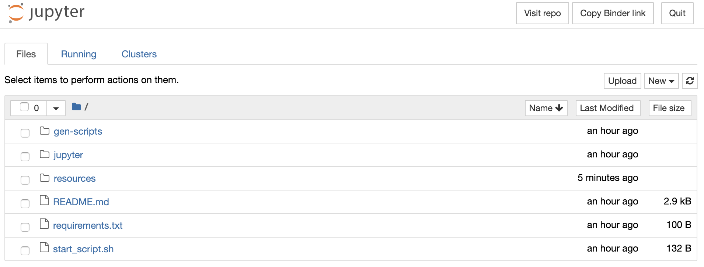
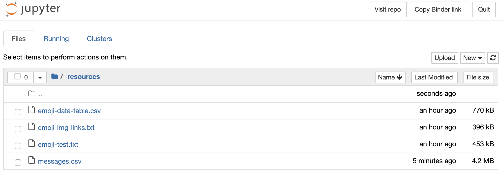

# Facebook Messenger Analysis
## Overview
This project is made for a hackathon whose task was to create something creative using portions of private data that large companies collect about their users.

As the title suggests, the main data source of this project - Facebook Messenger messages - was obtained by requesting a [Facebook Data Takeout](https://www.facebook.com/help/1701730696756992/).

The messages are processed having two main goals in mind:
* Visualize chat traffic in time
* Visualize emoji frequency

The visualizations are done using Python with Jupyter Notebooks.

## Explore the project
### Check out the static Jupyter Notebooks
---
If you would like to just get a quick glimpse of the static result of the visualizations, using a sample data source, visit these links:
* [Traffic Analysis](https://github.com/peter-gy/fb-messenger-analysis/blob/master/jupyter/messenger-traffic-visualization.ipynb)
* [Emoji Analysis](https://github.com/peter-gy/fb-messenger-analysis/blob/master/jupyter/messenger-emoji-visualization.ipynb)

### Check out the interactive Jupyter Notebooks
---
[Binder](https://mybinder.org/) is an awesome tool which allows you to docker containerize you GitHub Repository and to browse it inside a Jupyter Notebooks Environment.

Click on the badge below to launch the environment and to interact with the actual code which lives in this repository, using the sample data source. 

[](https://mybinder.org/v2/gh/peter-gy/fb-messenger-analysis/master)

You can find the Jupyter Notebooks in the `jupyter` subdirectory.

### Play with a local copy with your data
---
If you wish to use your own Facebook data to be visualized, you can simply clone this repository and explore it on your local machine. To do so just follow the steps below:

Request a [Facebook Data Takeout](https://www.facebook.com/help/1701730696756992/) and  unzip the downloaded data. 
**Make sure to have your data downloaded in JSON format.**

Clone the project
```bash
git clone https://github.com/peter-gy/fb-messenger-analysis.git
```

cd into the repo root and copy the `messages` folder from your takeout folder into a folder called `private-resources` inside the repo.
```bash
cd fb-messenger-analysis 
mkdir private-resources
mv path/to/facebook-yourname/messages private-resources/messages
```

[Install Jupyter Notebooks](https://jupyter.org/install)

Download the required python dependencies using [pip](https://pip.pypa.io/en/stable/installing/)
```bash
pip install numpy pandas matplotlib python-dateutil Pillow request
```

**Make sure to have some version of [Python 3](https://www.python.org/downloads/release/python-368/) installed**

Run the start script
```bash
chmod +x start_script.sh
./start_script.sh
```

If everything went well you should have Jupyter Notebooks open and ready to produce the visualization of your data!

### Play with your data online
---
If you don't want to to download any of the above dependencies but want to use your own data for the visualizations, you can use Binder to browse the docker containerized version of the Jupyter Notebook.

To do so, all you have to do is to produce a `messages.csv` file using your Facebook Data on your local machine by following these steps:

Clone the project
```bash
git clone https://github.com/peter-gy/fb-messenger-analysis.git
```

`cd` into the repo root and copy the `messages` folder from your takeout folder into a folder called `private-resources` inside the repo.
```bash
cd fb-messenger-analysis 
mkdir private-resources
mv path/to/facebook-yourname/messages private-resources/messages
```

Run the script to process your data offline
```bash
cd gen-scripts
python3 messages_to_csv.py 
```

Now open the [containerized Notebooks](https://mybinder.org/v2/gh/peter-gy/fb-messenger-analysis/master)

You should see the following:



Navigate to `resources` folder and replace the `messages.csv` file with the one that you have generated with the script previously



Now you can enter the jupyter folder and start to play with the Notebooks!